# Exploring Latent Classifications in Self-Reported Fire-Setting Behaviors

Adrian Seeley (OCT 2024)

## Abstract

This exploratory study investigates personal milestones related to fire-setting, aiming to uncover latent classifications within self-reported behaviors. A binary-response survey, administered anonymously, gathered responses from volunteer participants, allowing them to self-report without fear of incrimination. We used clustering techniques to identify response patterns, highlighting potential constellations of fire-related behaviors that may inform future research on disordered fire use. Results reveal nuanced trends, suggesting four potential behavior constellations while cautioning against direct application of findings in clinical or therapeutic settings due to sampling biases. Ultimately, this study serves as a preliminary step towards a deeper understanding of fire-related behaviors and their psychological implications.

## Purpose

This study examines personal milestones in relation to fire-setting behaviors, with a particular focus on uncovering latent classifications among various self-reported experiences. Rather than seeking to validate existing frameworks or prove hypotheses, the research aims to explore the underlying patterns that may emerge within the dataset. This exploration intends to provide insights into the subtle aspects of the human-fire relationship, contributing to the field's knowledge base.

## Methodology: Binary Response Survey

A binary-response survey was conducted to collect self-reported data on individuals' relationships with fire-setting behaviors. Volunteer participants were recruited through SurveyCircle.com, a platform that facilitates survey participation. These individuals were directed to a Google Forms-based questionnaire containing 52 yes-no questions regarding fire-related milestones. The survey design intentionally avoided gathering identifying information, ensuring that participants felt comfortable disclosing potentially incriminating experiences anonymously.

### Bias Acknowledgement

The participant pool was a convenience sample, predominantly comprising post-secondary students from North America and the European Union. As the study did not specifically target individuals convicted of arson or related offenses, the sample likely reflects a general population skewed away from habitual fire-setting behaviors. Thus, while the data reveals discernible patterns, these trends may not translate to populations with criminal fire-setting histories. This exploratory study aims to uncover insights for further research rather than providing actionable diagnostic criteria.

## Question Design

The questionnaire framed each question as a life milestone that, once achieved, would remain achieved. This design choice avoided inverse phrasing (e.g., "I have never set a large fire") to maintain the integrity of the Jaccard Index, Conditional Probability, Joint Probability, and Latent Classification analyses. Questions categorized as "high-risk" included behaviors traditionally associated with disordered fire-setting, while "non-high-risk" questions encompassed more common fire-related activities.

Three questions initially categorized as high-risk were re-evaluated due to cultural nuances. In rural and agricultural settings, burning items such as garbage and personal belongings is often routine. Future studies may benefit from contextualizing these behaviors to distinguish between typical practices and disordered fire-setting tendencies.

## Questions

The 52 questions are divided into those suggesting high-risk behavior and those unlikely to indicate disordered fire use. Phrased in the format "I have…," these questions were designed to capture a wide range of personal experiences. The full list of questions is provided below, with each classified as either high-risk or non-high-risk based on preliminary evaluations.

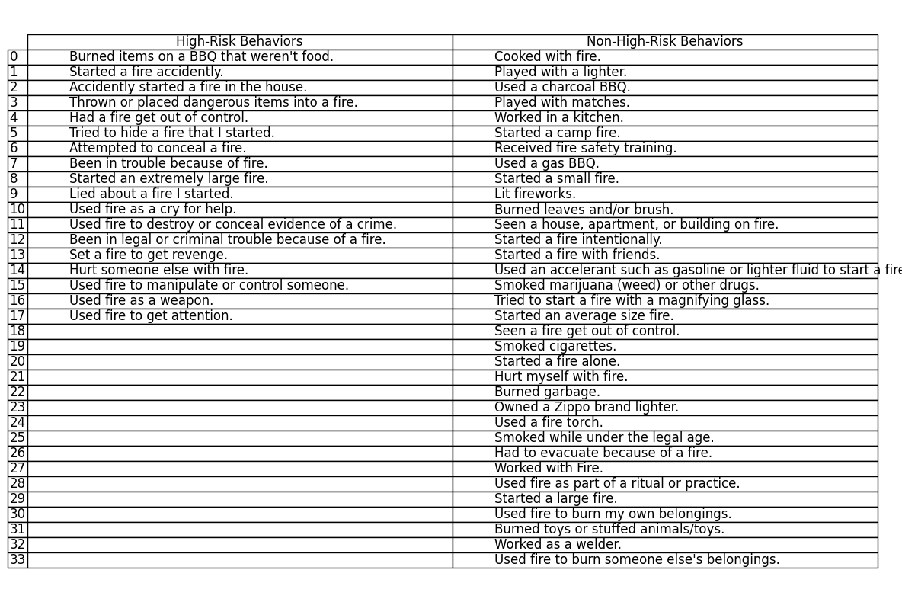

## Response Distribution

The following figures illustrate the distribution of "yes" and "no" responses across questions, ranked by frequency of "yes" responses. High-risk milestones generally appear less frequently, consistent with the anticipated sparsity of such behaviors in the general population.

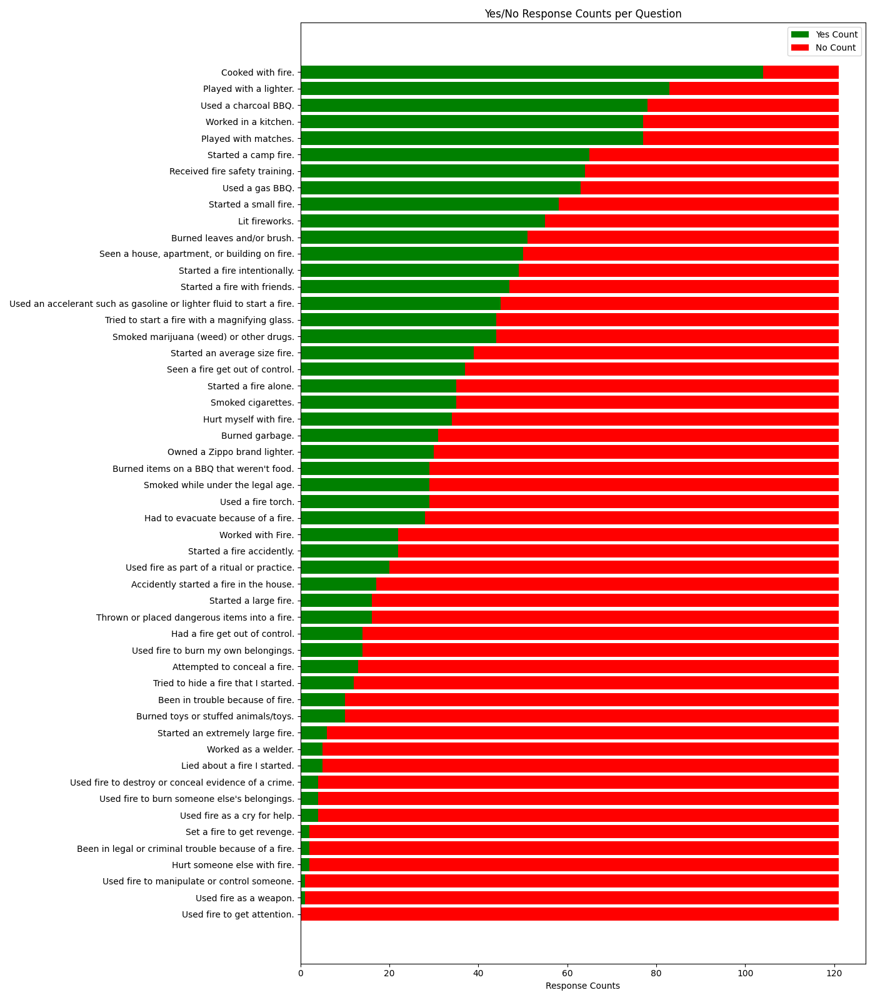
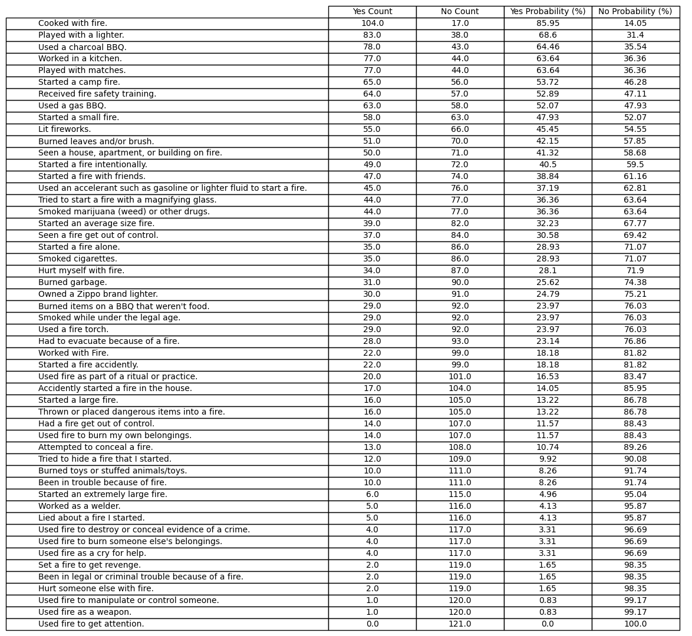

This pattern reinforces the challenge of studying disordered fire-setting behaviors in broader populations. For example, while 30% of respondents reported smoking cigarettes—a rate slightly lower than national averages in North America—no participants admitted to using fire explicitly for attention-seeking purposes. This may reflect either the rarity of such behavior or the limitations of self-reporting sensitive activities.

## High-Risk Group Comparison

To further examine high-risk behaviors, participants were divided into two groups: those with zero "yes" responses to high-risk questions and those with one or more. The baseline, non-high-risk, and high-risk probabilities are shown in the heatmap and table below. Results suggest that isolating participants with any high-risk behaviors from the rest tends to concurrently isolate other fire-setting experiences, highlighting fire’s dual role as a familiar tool and a mechanism for disorder in certain contexts.

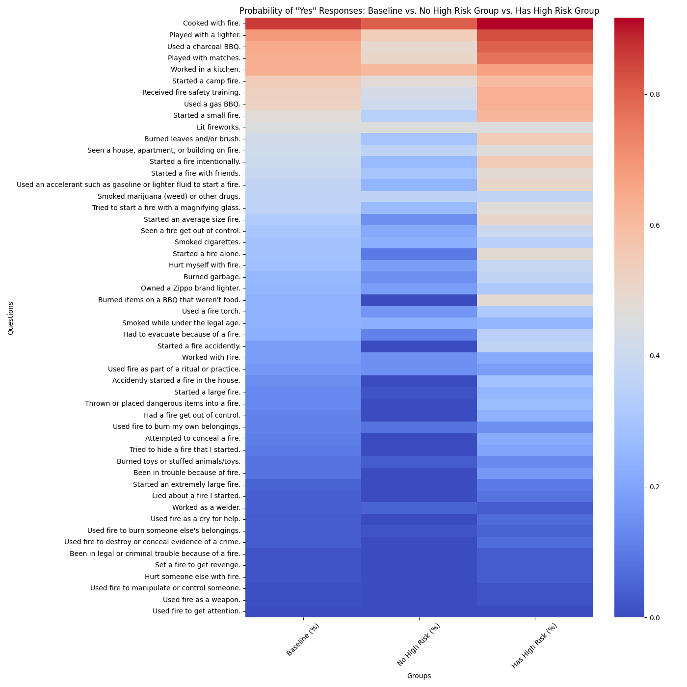
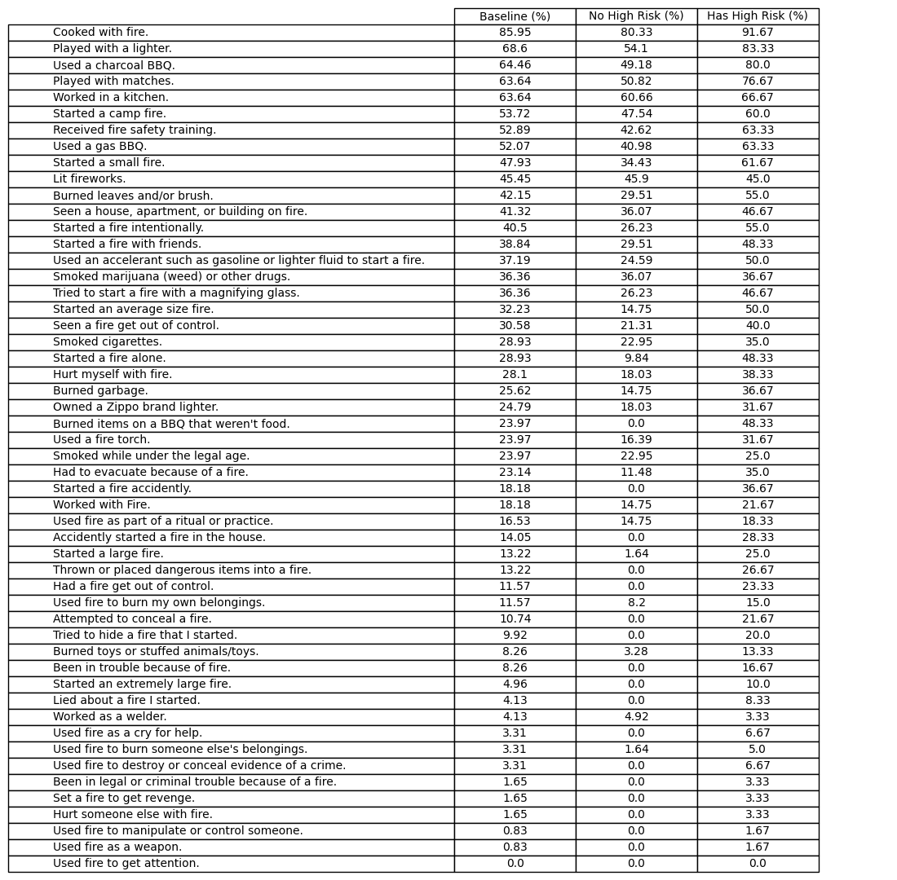

The stacked bar charts below depict the distribution of high-risk and non-high-risk behaviors within individual respondents, revealing an underlying correlation between the two categories. Notably, respondents with high-risk behaviors also tend to exhibit more non-high-risk behaviors, suggesting that experience with fire-setting may influence risk propensity.

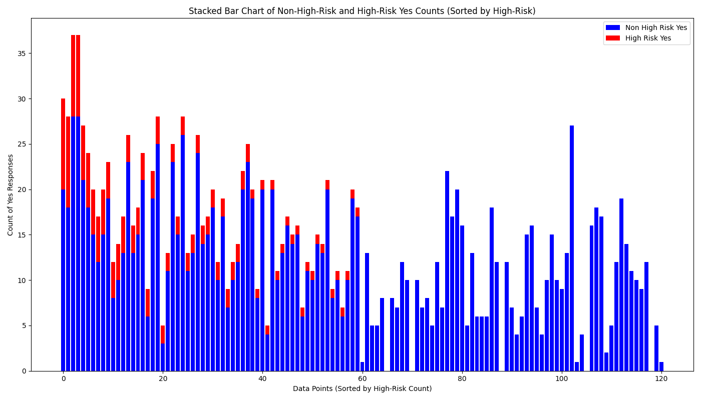

## Joint Probability Matrix Heatmap

The joint probability matrix heatmap illustrates how common and rare behaviors intersect. Three key behavior constellations emerged: a cluster of frequent, low-risk activities, a set of accidental fire events, and a grouping of high-risk activities. Future studies should refine this analysis by isolating motivations and specific contexts to better understand these patterns.

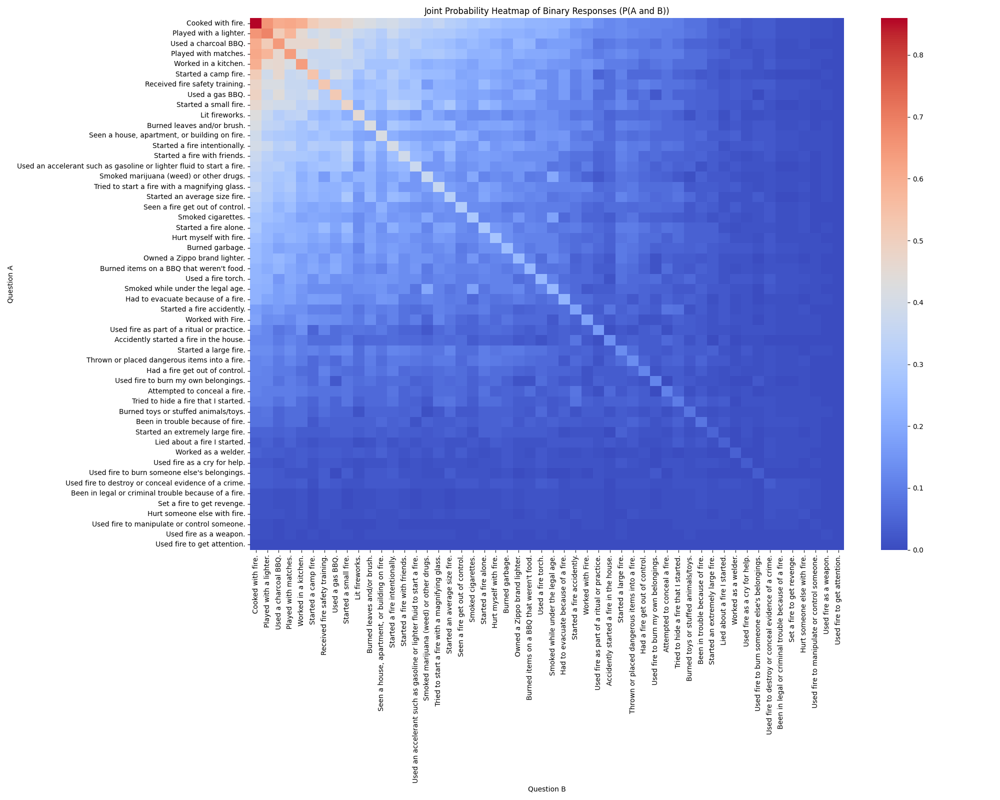

## Jaccard Index Matrix Heatmap

The Jaccard Index further clarifies these constellations, revealing a fourth potential grouping of social fire-related behaviors, such as recreational bonfires. This category appears distinct from disordered fire-setting, suggesting cultural influences on fire use that may vary by region and community.

## Conditional Probability Matrix Heatmap

This heatmap confirms the challenge of predicting high-risk behaviors based solely on low-risk indicators, as the overall gradient reflects a general relationship rather than strong predictor-response ties. Thus, fire’s role as a tool across diverse contexts may overshadow specific behaviors, reinforcing the need for broader contextualization in future studies.

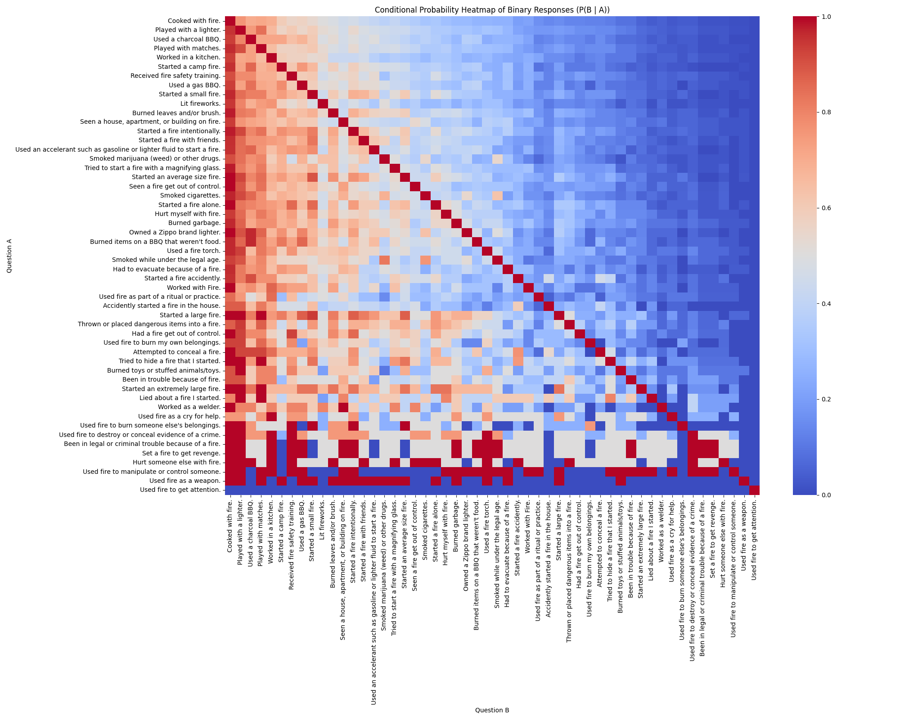

## Latent Classification Analysis

Gaussian Mixture Models (GMM) and K-Means clustering analyses were employed to estimate latent classes within the dataset. Using AIC, BIC, and inertia measures, we determined optimal clustering at 4-8 classes, ultimately selecting a six-cluster K-Means model as representative. These analyses reveal potential intersections of fire-related behaviors across both common and disordered contexts.

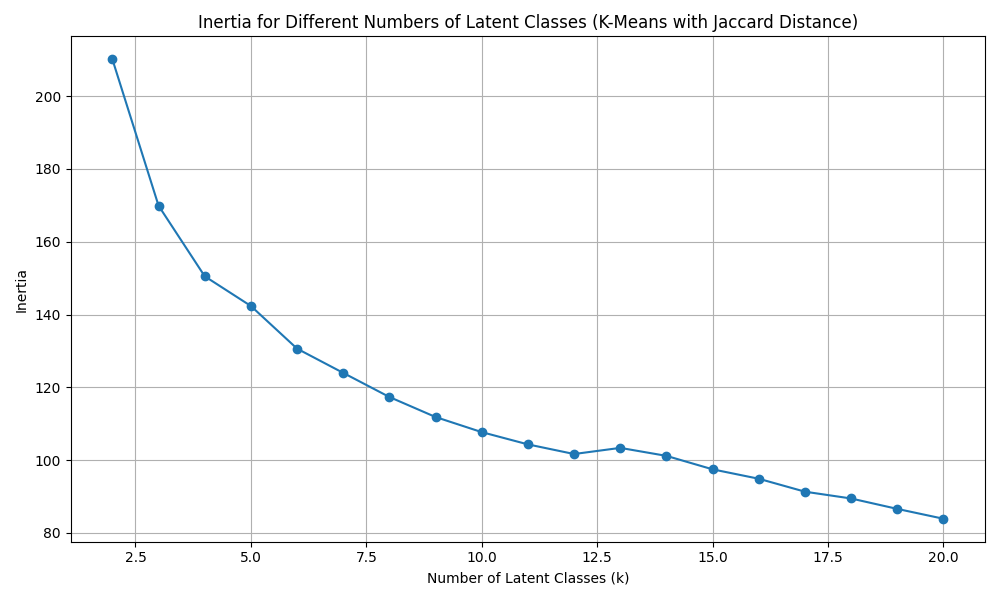

### Gaussian Mixture Models and K-Means

These clustering techniques offer complementary insights, with GMM capturing variance and K-Means highlighting distinct response patterns. When high-risk milestones are emphasized, distinct relationships emerge, particularly among disordered fire uses.

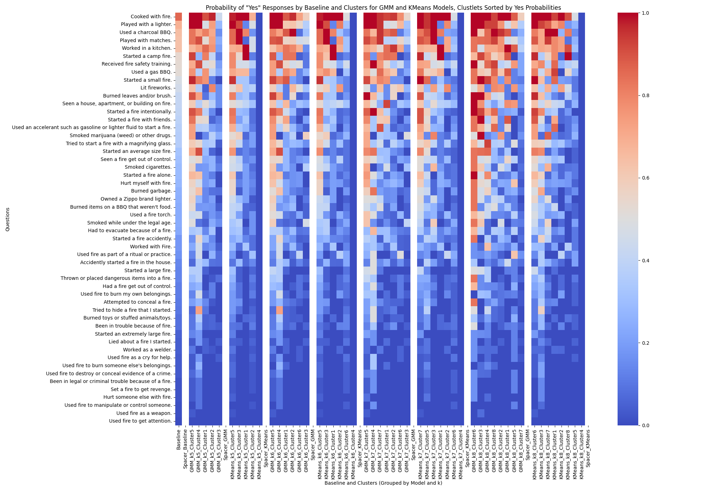
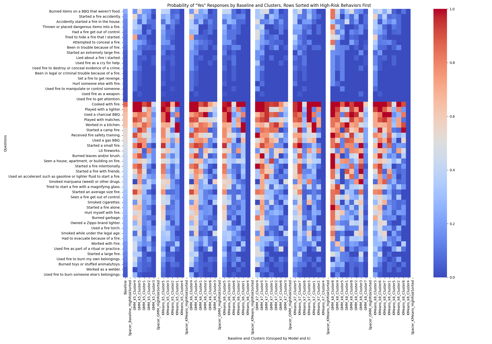

### K-Means K=6 Results

The six-cluster K-Means model yielded discernible patterns across high-risk and non-high-risk behaviors. This table provides a summary of response distributions across each cluster, supporting the existence of the four identified behavior constellations. Future studies should validate these clusters with larger samples and enhanced contextual details to clarify behavior motivations.

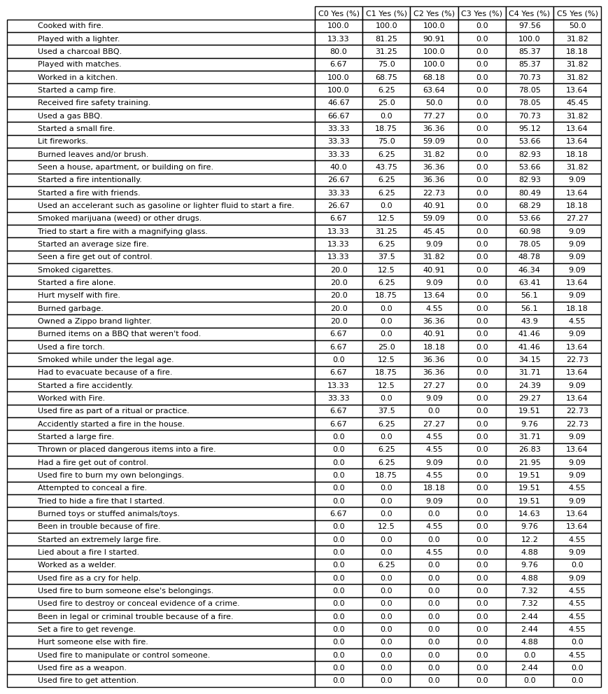

## Conclusion

This study reveals distinct patterns in self-reported fire-setting behaviors, suggesting four key behavior constellations: common low-risk fire use, accidental incidents, high-risk fire activities, and social recreational fires. While the exploratory nature of this research precludes definitive conclusions, the findings underscore the complexity of fire-related behaviors and their underlying motivations. Further research, particularly with targeted high-risk populations, will be essential to validate these classifications and develop actionable insights for understanding and addressing disordered fire use.